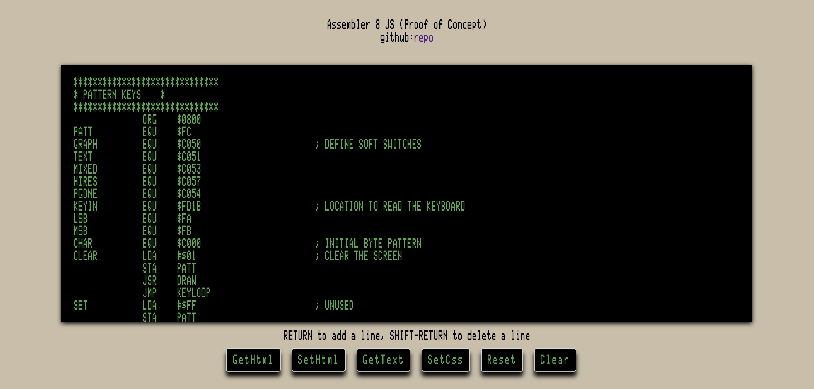

### Assembler 8 JS (Proof of Concept)

A Javascript 6502 assembly text editor inspired by the Merlin 8 Assembler for the Apple II

This is an **incomplete** proof of concept demonstrating the use of Javascript and the browser's [contenteditable](https://developer.mozilla.org/en-US/docs/Web/Guide/HTML/Editable_content) attibute to implement a simple in-browser assembly editor.

[Give it a try](https://wwlib.org/assembler-8-js/)



#### Motivation
- Developing Apple II (6502) assembly code would be easier with a column-oriented editor
- There does not seem to be a good browser-based, cross-platform, open source column-oriented editor appropriate for writing Apple II (6502) assembly.
- Editors like Ace and Monaco don't seem to support column-oriented modes.
- Assembly
- In assembly code, spaces should indicate 'tabstop' breaks
- Online conversations about tabstops, elastic tabstops, etc confirm the need and also show the lack of available solutions that are appropriate for assembly:
  - http://nickgravgaard.com/elastic-tabstops/
  - http://tibleiz.net/code-browser/elastic-tabstops.html
  - http://tomaslind.net/2016/02/18/how-to-align-columns-in-notepad/
  - https://www.ultraedit.com/support/tutorials-power-tips/ultraedit/csv-files.html


#### Merlin
- Merlin source code text can be pasted into the Assembler 8 editor
- The code is formatted in Merlin-style columns
- The code can be edited using standard mouse and keboard input
- The edited code can be exported to Merlin-fiendly, space-delimited text

#### Status
- Currenty, a proof of concept of a simple in-browser assembly text editor

#### Todo
- convert to Typescript
- add better vertical keyboard navigation
- ...
- integrate a Javascript assembler

#### Reference
- How to build your own WYSIWYG Editor
  - https://codeburst.io/how-to-build-your-own-wysiwyg-editor-6002fa3f5ea8
- contentEditable
  - https://ckeditor.com/blog/ContentEditable-The-Good-the-Bad-and-the-Ugly/
  - https://javascript.info/mutation-observer
  - https://medium.engineering/why-contenteditable-is-terrible-122d8a40e480
  - https://medium.com/@adrianmcli/a-beginner-s-guide-to-draft-js-d1823f58d8cc
  - https://www.mozzafiller.com/posts/how-does-monaco-editor-enable-text-editing-on-a-web-page
- Keyboard events
  - https://javascript.info/keyboard-events


#### Controls
- GetHTML: displays the editor html in the I/O text area
- SetHTML: replaces the editor html with the contents of the I/O text area
- GetText: exports the editor HTML to the I/O text area as Merlin-friendly, space-delimited text
- SetCSS: replaces the active CSS with the contents of the CSS text area
- Reset: restores the editor with example code
- Clear: clears the editor


#### examples
- ring the BELL
```
 ORG $300
 EQU $F8DD
START JSR BELL ;RING THE BELL
END RTS

```

- hires byte patterns from keyboard input
```
*****************************************
*           PATTERN KEYS                *
*****************************************
 ORG $0800 
PATT EQU $FC 
GRAPH EQU $C050 ; DEFINE SOFT SWITCHES
TEXT EQU $C051 
MIXED EQU $C053 
HIRES EQU $C057 
PGONE EQU $C054 
KEYIN EQU $FD1B ; LOCATION TO READ THE KEYBOARD
LSB EQU $FA 
MSB EQU $FB 
CHAR EQU $C000 ; INITIAL BYTE PATTERN
CLEAR LDA #$01 
 STA PATT 
 JSR DRAW 
 JMP KEYLOOP 
SET LDA #$FF 
 STA PATT 
 JSR DRAW 
KEYLOOP LDA CHAR 
 CMP #$80 ; CHECK FOR CHARACTER
 BCC KEYLOOP ; WAIT FOR CHARACTER
 JSR KEYIN ; GET KEY VALUE
 STA PATT ; SET PATT TO KEY VALUE
 CMP #$C3 ; CHECK FOR C
 BEQ END ; END IF C
 NOP 
 LDA $C010 ; CLEAR THE KEY STROBE
 JSR DRAW 
 JMP KEYLOOP 
ROTATE CLC 
 ROL PATT 
 BNE ROTRET 
 LDA #$01 
 STA PATT 
ROTRET RTS 
END LDA TEXT ; SET TEXT MODE
 BRK 
DRAW LDA #$20 
 STA MSB 
 LDA #$00 
 STA LSB 
 LDY #$00 ; TRIGGER SOFT SWITCHES
 LDA GRAPH 
 LDA HIRES 
 LDA PGONE 
LOOP LDA PATT 
 STA (LSB),Y 
 INC LSB 
 BEQ BUMPMSB 
 JMP LOOP 
BUMPMSB INC MSB 
 LDA #$40 
 CMP MSB 
 BEQ RETURN 
 JMP LOOP 
RETURN RTS

```

#### PATTERN KEYS
The PATTERN KEYS program [docs/T.PATT_KEYS](docs/T.PATT_KEYS) uses the value of the latest key pressed to set a hires pattern on the Apple II screen.  
- Read the T.PATT_KEYS text file into the Merlin 8 Assembler
- Assemble the code
- Save the object file
- Call -151
- BLOAD PATT_KEYS
- 800G

The output will look like:  


